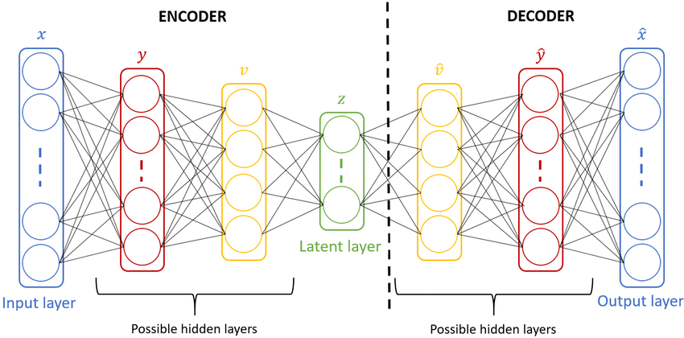
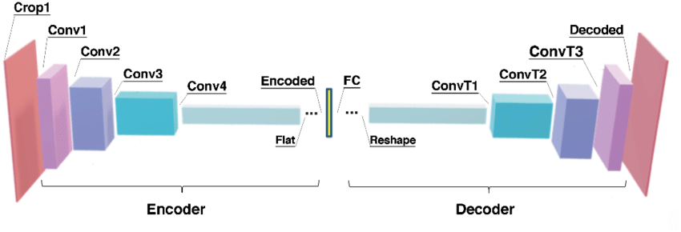
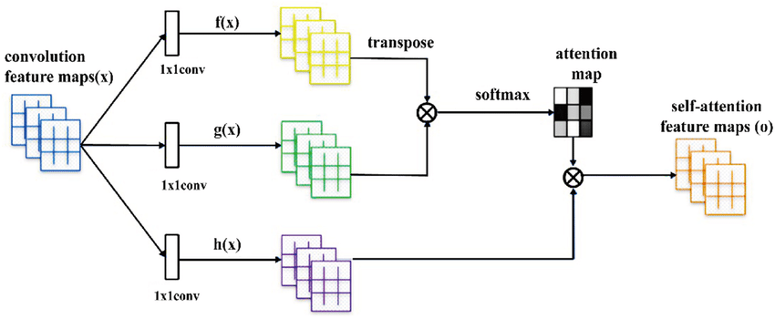
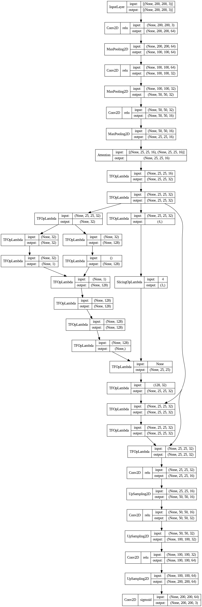

# Face2Sketch Generative Models: A Study on Convolutional Autoencoder with Self-Attention and Quantization (CASQ)

## Abstract
This study introduces a novel model, Convolutional Autoencoder with Self-Attention and Quantization (CASQ), for the Face2Sketch task in computer vision. We demonstrate how CASQ outperforms traditional deep autoencoder and variational autoencoder models on the CUHK face sketch dataset. This advancement has implications in digital entertainment, forensic art, and facial recognition systems.

## Introduction
The study begins with a historical overview of face recognition technology, evolving into the specialized area of Face2Sketch. This technology automatically generates sketches from facial images using algorithms and artificial intelligence, proving useful in various fields including crime detection, security monitoring, and entertainment.

## Literature Review
We review the advancements in Face2Sketch, including autoencoders and generative adversarial networks (GANs). The research discusses the evolution and applications of these models, paving the way for our proposed CASQ model.

### Model Architecture
- **Autoencoder (AE)**: Utilizes encoder and decoder for data compression and decompression.
- **Generative Adversarial Networks (GANs)**: Consists of a generator and discriminator, working in tandem to produce realistic outputs.
- **Convolutional Autoencoder with Self-Attention and Quantization (CASQ)**: Our proposed model combines a convolutional autoencoder with self-attention mechanisms and quantization techniques.

## Preliminary on Methodologies
We compare Deep Autoencoder (DAE), Variational Autoencoder (VAE), and our CASQ model, evaluating them based on Structural Similarity Index Measure (SSIM) and Mean Squared Error (MSE).

### Model Comparisons and Training
- **DAE and VAE**: Established models serving as benchmarks for comparison.
- **CASQ**: Exhibits rapid adaptability and learning power, augmented with self-attention and quantization.

### Experimental Results
CASQ demonstrates superior performance in terms of both visual quality and quantitative metrics compared to DAE and VAE.

### Plots and Figures
- 
- 
- 
- 
- 
- 
- 

## Conclusion
Our research confirms the effectiveness of CASQ in Face2Sketch generation, showcasing the potential of self-attention and quantization techniques in image generation tasks. This study opens avenues for further exploration and optimization of these techniques in broader image generation contexts.

## References
## References

<a id="1">[1]</a> W. W. Bledsoe and I. Browning, "Pattern recognition and reading by machine," in Papers presented at the December 1-3, 1959, eastern joint IRE-AIEE-ACM computer conference, 1959, pp. 225–232.

<a id="2">[2]</a> A. J. Goldstein, L. D. Harmon, and A. B. Lesk, "Identification of human faces," Proceedings of the IEEE, vol. 59, no. 5, pp. 748–760, 1971.

<a id="3">[3]</a> L. Sirovich and M. Kirby, "Low-dimensional procedure for the characterization of human faces," Josa a, vol. 4, no. 3, pp. 519–524, 1987.

<a id="4">[4]</a> P. N. Belhumeur, J. P. Hespanha, and D. J. Kriegman, "Eigenfaces vs. fisherfaces: Recognition using class specific linear projection," IEEE Transactions on pattern analysis and machine intelligence, vol. 19, no. 7, pp. 711–720, 1997.

<a id="5">[5]</a> Y. Kortli, M. Jridi, A. Al Falou, and M. Atri, "Face recognition systems: A survey," Sensors, vol. 20, no. 2, p. 342, 2020.

<a id="6">[6]</a> X. Lv, M. Su, and Z. Wang, "Application of face recognition method under deep learning algorithm in embedded systems," Microprocessors and Microsystems, p. 104034, 2021.

<a id="7">[7]</a> W. Wan, Y. Gao, and H. J. Lee, "Transfer deep feature learning for face sketch recognition," Neural Computing and Applications, vol. 31, pp. 9175–9184, 2019.

<a id="8">[8]</a> S. Yu, H. Han, S. Shan, A. Dantcheva, and X. Chen, "Improving face sketch recognition via adversarial sketch-photo transformation," in 2019 14th IEEE International Conference on Automatic Face & Gesture Recognition (FG 2019). IEEE, 2019, pp. 1–8.

<a id="9">[9]</a> X. Wang and X. Tang, "Face photo-sketch synthesis and recognition," IEEE transactions on pattern analysis and machine intelligence, vol. 31, no. 11, pp. 1955–1967, 2008.

<a id="10">[10]</a> H. Bi, N. Li, H. Guan, D. Lu, and L. Yang, "A multi-scale conditional generative adversarial network for face sketch synthesis," in 2019 IEEE international conference on image processing (ICIP). IEEE, 2019, pp. 3876–3880.

<a id="11">[11]</a> D. Bank, N. Koenigstein, and R. Giryes, "Autoencoders," arXiv preprint arXiv:2003.05991, 2020.

<a id="12">[12]</a> Q. Meng, D. Catchpoole, D. Skillicom, and P. J. Kennedy, "Relational autoencoder for feature extraction," in 2017 International joint conference on neural networks (IJCNN). IEEE, 2017, pp. 364–371.

<a id="13">[13]</a> I. Goodfellow, J. Pouget-Abadie, M. Mirza, B. Xu, D. Warde-Farley, S. Ozair, A. Courville, and Y. Bengio, "Generative adversarial networks," Communications of the ACM, vol. 63, no. 11, pp. 139–144, 2020.

<a id="14">[14]</a> H. Tang, X. Chen, W. Wang, D. Xu, J. J. Corso, N. Sebe, and Y. Yan, "Attribute-guided sketch generation," in 2019 14th IEEE International Conference on Automatic Face & Gesture Recognition (FG 2019). IEEE, 2019, pp. 1–7.

<a id="15">[15]</a> X. Qi, M. Sun, W. Wang, X. Dong, Q. Li, and C. Shan, "Face sketch synthesis via semantic-driven generative adversarial network," in 2021 IEEE International Joint Conference on Biometrics (IJCB). IEEE, 2021, pp. 1–8.

<a id="16">[16]</a> J. Hou, J. D. Deng, S. Cranefield, and X. Ding, "Cross-domain latent modulation for variational transfer learning," in Proceedings of the IEEE/CVF Winter Conference on Applications of Computer Vision, 2021, pp. 3149–3158.

<a id="17">[17]</a> Z. Cheng, H. Sun, M. Takeuchi, and J. Katto, "Performance comparison of convolutional autoencoders, generative adversarial networks and super-resolution for image compression," in Proceedings of the IEEE Conference on Computer Vision and Pattern Recognition Workshops, 2018, pp. 2613–2616.

<a id="18">[18]</a> J. Bao, L. Li, and A. Davis, "Variational autoencoder or generative adversarial networks? A comparison of two deep learning methods for flow and transport data assimilation," Mathematical Geosciences, vol. 54, no. 6, pp. 1017–1042, 2022.

<a id="19">[19]</a> C. Zhou and R. C. Paffenroth, "Anomaly detection with robust deep autoencoders," in Proceedings of the 23rd ACM SIGKDD international conference on knowledge discovery and data mining, 2017, pp. 665–674.

<a id="20">[20]</a> K. G. Lore, A. Akintayo, and S. Sarkar, "Llnet: A deep autoencoder approach to natural low-light image enhancement," Pattern Recognition, vol. 61, pp. 650–662, 2017.

<a id="21">[21]</a> X. Hou, L. Shen, K. Sun, and G. Qiu, "Deep feature consistent variational autoencoder," in 2017 IEEE winter conference on applications of computer vision (WACV). IEEE, 2017, pp. 1133–1141.

<a id="22">[22]</a> Z. Cheng, H. Sun, M. Takeuchi, and J. Katto, "Deep convolutional autoencoder-based lossy image compression," in 2018 Picture Coding Symposium (PCS). IEEE, 2018, pp. 253–257.

<a id="23">[23]</a> A. Vaswani, N. Shazeer, N. Parmar, J. Uszkoreit, L. Jones, A. N. Gomez, Ł. Kaiser, and I. Polosukhin, "Attention is all you need," Advances in neural information processing systems, vol. 30, 2017.

<a id="24">[24]</a> H. Zhang, I. Goodfellow, D. Metaxas, and A. Odena, "Self-attention generative adversarial networks," in International conference on machine learning. PMLR, 2019, pp. 7354–7363.

<a id="25">[25]</a> A. Van Den Oord, O. Vinyals et al., "Neural discrete representation learning," Advances in neural information processing systems, vol. 30, 2017.

<a id="26">[26]</a> M. Abadi, A. Agarwal, P. Barham, E. Brevdo, Z. Chen, C. Citro, G. S. Corrado, A. Davis, J. Dean, M. Devin, S. Ghemawat, I. Goodfellow, A. Harp, G. Irving, M. Isard, Y. Jia, R. Jozefowicz, L. Kaiser, M. Kudlur, J. Levenberg, D. Mane, R. Monga, S. Moore, D. Murray, C. Olah, M. Schuster, J. Shlens, B. Steiner, I. Sutskever, K. Talwar, P. Tucker, V. Vanhoucke, V. Vasudevan, F. Viegas, O. Vinyals, P. Warden, M. Wattenberg, M. Wicke, Y. Yu, and X. Zheng, "TensorFlow: Large-scale machine learning on heterogeneous systems," 2015, software available from tensorflow.org.

<a id="27">[27]</a> Csuperbobry, "Sonnet," https://github.com/deepmind/sonnet, 2020.

<a id="28">[28]</a> U. Sara, M. Akter, and M. S. Uddin, “Image quality 763 assessment through fsim, ssim, mse and psnr—a compar- 764 ative study,” Journal of Computer and Communications, 765 vol. 7, no. 3, pp. 8–18, 2019. 
